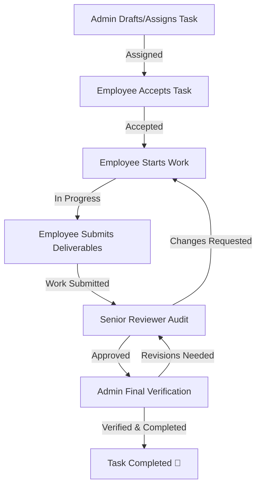

# 🌌 SyncOS Enterprise Suite

SyncOS is a high-performance, real-time corporate platform designed to consolidate operations, chat communications, task progression pipelines, human resource systems, and documentation. 

Inspired by the design aesthetics and speed of platforms like **ClickUp, Slack, Asana, Monday.com, and Linear**, SyncOS delivers a fluid dashboard experience that functions with localized fallbacks and real-time database syncing layers.

---

## 🚀 Key Modules & Architecture

### 1. Enterprise Task Management (Strict 5-Stage Approval Pipeline)
SyncOS enforces a clear operational structure for accountability and review:



*   **Employee Kanban**: Integrated drag-and-drop workspace containing progress tracking indicators, priority tags, and AI assistant widgets (to auto-generate subtask checklists and estimate duration).
*   **Senior Review Dashboard**: Allows designated department managers to instantly evaluate submissions, request modifications, or endorse work for Admin audit.
*   **Admin Verification Control**: Access to audit logs, rejection logs, and a dedicated queue to verify deliverables before marking them completed.

---

### 2. Super Admin Control & Chat Governance Dashboard
*   **Governance Dashboard**: Monitors user growth, department counts, document storage limits, and task productivity rates via responsive chart widgets (Area and Bar layout visualizers).
*   **Chat Control Hub**: View all personal (1-to-1) employee messages, project rooms, announcement channels, and audit soft-deleted logs.
*   **Department, Projects & Team Managers**: Dynamic registries to add new departments, invite staff members, edit roles, and assign leads.

---

### 3. Unified Real-Time Communication Hub
*   **Chat Channels**: Channels organized by Direct Messaging, Departmental Rooms, Project Rooms, and Company Broadcasts.
*   **Admin Mode Controls**: Pins important threads, locks chat channels, and allows system broadcast overrides.

---

### 4. HRMS, Calendar & Storage Vaults
*   **HRMS & Attendance**: Integrated employee profiles, check-in registries, and automated leave submission trackers.
*   **Document Vault**: Hierarchical directory system supporting folder structures, folder creation, file uploads, and search indices.
*   **Corporate Calendar**: Shared meeting planner, video call reservations, and agenda tracking list.

---

## 💾 Database Synchronization Model

SyncOS utilizes a dual-engine database layer to ensure high availability:

| Layer | Mode | Behavior |
| :--- | :--- | :--- |
| **Local Mock Engine** | Primary / Fallback | Hydrates immediately on app mount. Persists all changes inside `localStorage` for responsive client performance. |
| **Supabase Postgres Sync** | Write-Through Sync | Checks for `.env` config. If available, automatically maps database actions (insert, update, delete) to remote Supabase endpoints synchronously. |

---

## 🎨 Premium Theme & Styling System

*   **Hydration Flash Shield**: An early-injection blocking header script detects theme preferences and applies the `.dark` class to the DOM before React finishes mounting, avoiding flashing white screens.
*   **Theme Integration**: Handled using high-contrast CSS variable tokens defined in `globals.css` with dark mode support.
*   **Form Inheritance**: Standard input elements, selection panels, and textareas inherit variable system themes dynamically.

---

## 🛠️ Development & Production Operations

### Dependencies
Ensure Node.js is installed. Run the initial dependency installer:
```bash
npm install
```

### Run Locally (Development)
Launch the hot-reloading server:
```bash
npm run dev
```
Open [http://localhost:3000](http://localhost:3000) inside your web browser.

### Create Optimized Build (Production)
Compile, run TypeScript checks, and build pages:
```bash
npm run build
```

---
*Developed as an enterprise pair-programming project for SyncOS.*
